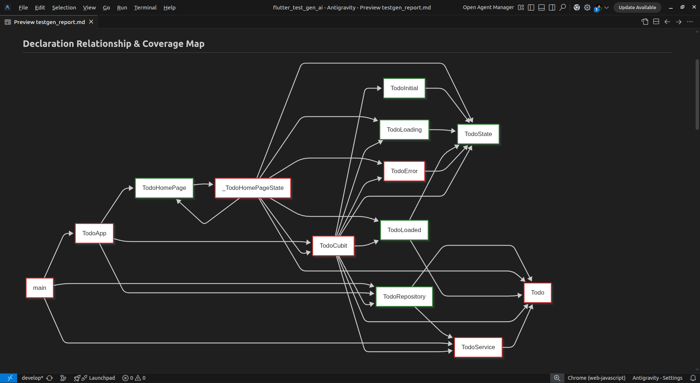

# 🚀 Flutter AI Test Generator (`flutter_test_gen_ai`)

An intelligent, coverage-driven test generation CLI tool for Dart and Flutter applications. Powered by Google Gemini, it automatically identifies untested code (including business logic, state management, repositories, services, and **Flutter UI Widgets**), gathers surrounding dependency context, and writes, runs, and self-corrects test cases until your test coverage increases.

---

## ⚡ Quick Start

### 1. Set the API Key
Get a Google Gemini API Key and set it as an environment variable:
```bash
export GEMINI_API_KEY="your-api-key-here"
```

### 2. Run the Tool
To scan and generate tests for your entire package:
```bash
dart run flutter_test_gen_ai --api-key $GEMINI_API_KEY
```

---

## 🛠️ How to Use Like a Pro

### 🎯 1. Target Specific Files (Recommended)
By default, the tool scans your entire `lib/` directory. For large codebases, this can consume many tokens and API calls. To focus on a specific cubit, controller, or service:
```bash
dart run flutter_test_gen_ai --target-files lib/counter_cubit.dart,lib/src/auth_service.dart
```
> [!TIP]
> Always target specific files during development to speed up execution and focus Gemini on the code you are actively working on.

### 🎨 2. Smart Flutter Widget & State Testing
The tool statically analyzes your project to handle advanced architectures out-of-the-box:
* **State Management**: Generates Cubit and BLoC tests using the `bloc_test` package.
* **Widget Testing**: For highly reliable UI testing, add `Semantics` labels and unique `Key` parameters to your widgets. The generator automatically discovers them and generates clean `testWidgets()` suites.

### 📈 3. Keep Only Effective Tests (Highly Recommended)
If you only want to save tests that *actually improve* your code coverage (discarding redundant or duplicate tests):
```bash
dart run flutter_test_gen_ai -e
# or
dart run flutter_test_gen_ai --effective-tests-only
```

### 📊 4. Generate Visual Coverage Diagrams
To automatically generate a color-coded dependency and coverage flowchart (`testgen_report.md`) utilizing Mermaid:
```bash
dart run flutter_test_gen_ai --generate-report
```
* **Green Nodes**: Already fully covered.
* **Blue Nodes**: Covered by newly generated tests in this run.
* **Orange Nodes**: Code still lacking coverage.

### 🧠 5. Tune the AI Generator & Context
* **Switch Models**: Use a different Gemini model if you hit limits or need more power:
  ```bash
  dart run flutter_test_gen_ai --model gemini-3-flash-preview
  ```
* **Limit Dependency Scan Depth**: Restrict how deep the static analyzer searches for type definitions when building the context for the LLM (default is 10):
  ```bash
  dart run flutter_test_gen_ai --max-depth 5
  ```
* **Self-Correction Retries**: Set how many times the tool will pass compiler errors/test failures back to Gemini to self-heal (default is 5):
  ```bash
  dart run flutter_test_gen_ai --max-attempts 3
  ```

### 🔍 6. Debugging & Verbose Mode
If a test keeps failing validation and gets deleted, use verbose mode to write the full prompts and LLM conversation history to `testgen_prompts.log` for inspection:
```bash
dart run flutter_test_gen_ai -v
```

---

## ⚙️ CLI Options & Configuration

| Option | Abbreviation | Default Value | Description |
| :--- | :---: | :---: | :--- |
| `--package` | - | `.` | Root directory of the package to test. |
| `--target-files` | - | `[]` | Comma-separated list of target files (e.g. `lib/foo.dart,lib/src/bar.dart`) to restrict generation scope. |
| `--effective-tests-only`| `-e` | `false` | Discards test files if they fail to increase line coverage. |
| `--generate-report` | - | `false` | Generate a Markdown report with a Mermaid dependency and coverage diagram. |
| `--model` | - | `gemini-3-flash-preview` | The Gemini model identifier to query. |
| `--api-key` | - | Env `GEMINI_API_KEY` | Gemini API token for authorization. |
| `--max-depth` | - | `10` | Max depth for tracing declaration dependency trees. |
| `--max-attempts` | - | `5` | Retries allowed for the self-healing engine on test failure. |
| `--port` | - | `0` | Dart VM service port (used for pure Dart packages). |
| `--function-coverage`| `-f` | `false` | Enable detailed function coverage collection. |
| `--branch-coverage` | `-b` | `false` | Enable detailed branch coverage collection. |
| `--verbose` | `-v` | `false` | Outputs detailed logging and writes prompts to `testgen_prompts.log`. |

---

## 📦 What the Tool Handles Automatically

* **Framework Compatibility**: The tool automatically checks your `pubspec.yaml`. If it is a Flutter project, it collects coverage via `flutter test --coverage` (parsing the generated `lcov.info`). If it is a pure Dart project, it collects coverage directly from the Dart VM Service.
* **Flutter Widget Testing**: Automatically detects when it is testing a widget class (subclassing `StatelessWidget`, `StatefulWidget`, or `State`). It parses the widget's `build` method to identify `Semantics` labels and `Key` annotations, feeding these UI elements directly to Gemini's prompt to generate compile-safe widget tests (preventing selector hallucinations).
* **Auto-installed Dependencies**: If your package is missing `test`, `bloc_test`, or mocking packages (when state management or data/service layers are parsed), the tool automatically adds them to your `dev_dependencies`.
* **Quarantined Output**: All generated tests are written to `test/testgen/` to keep them clean and separated from your hand-written test files.


### 💡 Testing Flutter Code Result


