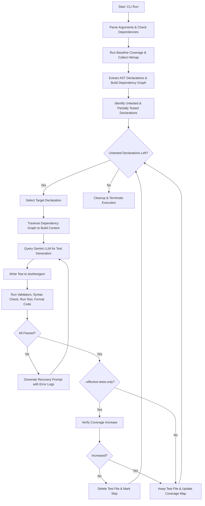

# 🚀 Flutter AI Test Generator (`flutter_test_gen_ai`)

An intelligent, coverage-driven test generation CLI tool for Dart and Flutter applications. Powered by Google Gemini, it analyzes code structure, maps declarations, gathers dependency context, and writes, runs, and self-corrects test cases until your code coverage increases.

---

## 💡 Why `flutter_test_gen_ai`?

### The Problem
* **Tedious Writing**: Writing unit and integration tests manually to cover edge cases takes significant developer time.
* **Coverage Gaps**: Identifying exactly which lines, functions, or branches are untested requires bouncing between coverage reports and source files.
* **Fragile Mocking**: AI tools often fail to generate valid test files because they lack structural context—generating calls to non-existent classes, incorrect constructors, or missing imports.

### The Solution
`flutter_test_gen_ai` acts as an automated QA engineer:
1. **Pinpoints Gaps**: It automatically instruments your test runner to collect line-by-line coverage and targets only untested sections.
2. **Injects Context**: It builds an AST dependency graph so Google Gemini receives not just the target function, but its surrounding dependencies, models, and signatures.
3. **Self-Heals**: If the generated test fails Dart analysis, tests, or formatting, the CLI loops the error traces back to Gemini to self-correct the code dynamically.
4. **Enforces Quality**: It validates that each generated test compiles, runs successfully, and (optionally) actually increases coverage before keeping it.

---

## 🛠️ Key Features

* 🧠 **AST-Powered Dependency Context**: Automatically traces constructor signatures, dependent classes, and imported helpers to prevent compile-time test errors.
* 🔄 **Self-Correcting Validation Loop**: Runs three layers of validation (**Dart Parser**, **Test Execution**, and **Dart Formatter**) with automatic retry logic.
* 🎯 **Effective-Only Mode (`-e`)**: Discards generated tests if they do not successfully improve coverage metrics.
* 📦 **Quarantined Output**: Isolates all AI-generated tests under `test/testgen/` to prevent contamination of your handcrafted test suites.
* ⚡ **Zero Setup Dependency Installer**: Detects if your project is missing the `test` package and automatically installs it via Dart Pub.

---

## 📐 Architecture & Execution Flow

Below is the step-by-step pipeline executed by [bin/flutter_test_gen_ai.dart](file:///home/arindam/Documents/flutter_test_gen_ai/bin/flutter_test_gen_ai.dart) when you run the tool:



### 1. Argument Parsing & Dependency Setup
Configures command flags and validates package paths. If the `test` library is missing from `pubspec.yaml`, the runner executes `dart pub add test --dev` automatically.

### 2. Dynamic Baseline Coverage Collection
Generates a temporary import file to ensure the coverage engine inspects all library files even if they have no existing tests. Spawns the Dart VM service with isolate pausing to collect precise execution hitmaps via [lib/src/coverage/coverage_collection.dart](file:///home/arindam/Documents/flutter_test_gen_ai/lib/src/coverage/coverage_collection.dart).

### 3. AST Parsing & Declaration Mapping
Traverses the AST using the Dart `analyzer` package in [lib/src/analyzer/extractor.dart](file:///home/arindam/Documents/flutter_test_gen_ai/lib/src/analyzer/extractor.dart). Maps all class constructors, functions, methods, and variables with their start/end line numbers.

### 4. Dependency Context Resolution
Traces references from the target declaration outward (up to `--max-depth`). This extracts structural details of any custom types or helper functions consumed by the target code, giving the LLM a clear map for creating mocks and setup fixtures.

### 5. Iterative Generation & Multi-Stage Validation
Sends prompts to the LLM via [lib/src/LLM/test_generator.dart](file:///home/arindam/Documents/flutter_test_gen_ai/lib/src/LLM/test_generator.dart). The generated file is validated using [lib/src/LLM/validator.dart](file:///home/arindam/Documents/flutter_test_gen_ai/lib/src/LLM/validator.dart):
* **Analysis**: Syntax parser validation.
* **Execution**: Runs the test to confirm it passes.
* **Formatting**: Verifies stylistic rules match `dart format`.
If a check fails, the CLI feeds the analyzer error/stack trace back to the LLM to self-heal (up to `--max-attempts` times).

---

## 🚀 Getting Started

### 1. Set the API Key
Get a Google Gemini API Key and export it to your environment:
```bash
export GEMINI_API_KEY="your-api-key-here"
```

### 2. Run the Tool
Run the test generator inside your Dart/Flutter project directory:
```bash
# Run on the current directory using environment variables for authentication
dart run flutter_test_gen_ai

# Or specify a target package and supply the API key directly
dart run flutter_test_gen_ai --package /path/to/project --api-key AIzaSy...
```

---

## ⚙️ CLI Options & Configuration

| Option | Abbreviation | Default Value | Description |
| :--- | :---: | :---: | :--- |
| `--package` | - | `.` | Root directory of the package to test. |
| `--target-files` | - | `[]` | Comma-separated list of target files (e.g. `lib/foo.dart,lib/src/bar.dart`) to restrict generation scope. |
| `--port` | - | `0` | Dart VM service port. Uses a random free port by default. |
| `--function-coverage`| `-f` | `false` | Enable detailed function coverage collection. |
| `--branch-coverage` | `-b` | `false` | Enable detailed branch coverage collection. |
| `--scope-output` | - | `[]` | Limit coverage scopes (defaults to current package name). |
| `--model` | - | `gemini-3-flash-preview` | The Gemini model identifier to query. |
| `--api-key` | - | Env `GEMINI_API_KEY` | Gemini API token for authorization. |
| `--max-depth` | - | `10` | Max depth for tracing declaration dependency trees. |
| `--max-attempts` | - | `5` | Retries allowed for the self-healing engine on test failure. |
| `--effective-tests-only`| `-e` | `false` | Discards test files if they fail to increase line coverage. |
| `--verbose` | `-v` | `false` | Outputs detailed logging and writes prompts to `testgen_prompts.log`. |
| `--help` | `-h` | - | Shows command-line help description. |

---

## 📈 Demonstration

When run on a package (e.g. the provided Tic-Tac-Toe example inside [example/tic_tac_toe](file:///home/arindam/Documents/flutter_test_gen_ai/example/tic_tac_toe)), the CLI provides detailed progress logs:

```text
🚀 Starting Flutter AI Test Generator CLI 🚀
Step 1: Parsing command-line arguments...
Step 2: Working directory resolved to: /home/arindam/Documents/flutter_test_gen_ai/example/tic_tac_toe
Step 3: No target files specified, using all files in lib directory []
Step 4: Reading the Pubspec and Retrieving the Package Name: tic_tac_toe
[FLOW] Step 2: Reading package dependencies...
[FLOW] Step 3: Running existing tests to collect baseline coverage...
🚀 Starting code coverage collection for package at /home/arindam/Documents/flutter_test_gen_ai/example/tic_tac_toe
All tests passed!
[FLOW] Baseline coverage collected successfully.
[FLOW] Step 4: Analyzing package to extract code declarations...
[FLOW] Extracted 10 declarations in total.
[FLOW] Step 5: Identifying untested declarations based on coverage...
[FLOW] Found 4 untested/partially tested declarations.
[FLOW] Step 6: Initializing Google Gemini LLM wrapper...
[FLOW] Step 7: Starting test generation loop...

[FLOW] Selected Target: "makeMove" (ID: 38370) in lib/tic_tac_toe.dart
[FLOW] Uncovered lines for this declaration: [19, 20, 23, 25, 26, 27, 28, 29, 31]
[FLOW] Analyzing dependency context for "makeMove" up to depth of 10...
[FLOW] Sending request to Gemini LLM to generate tests...
Generating tests for makemove_38370_9_test.dart (attempt 1 of 5)
Writing test file to test/testgen/makemove_38370_9_test.dart
Running syntax check on test/testgen/makemove_38370_9_test.dart
✔✔ Validation passed, no syntax errors found
Running tests in test/testgen/makemove_38370_9_test.dart
✔✔ Validation passed, all tests executed successfully
Formatting test file at test/testgen/makemove_38370_9_test.dart
✔✔ Validation passed, test file is properly formatted
Test generation ended with TestStatus.created and used 1024 tokens.

[FLOW] Step 8: Disposing test generator and cleaning up...
[FLOW] Process finished successfully.
```
