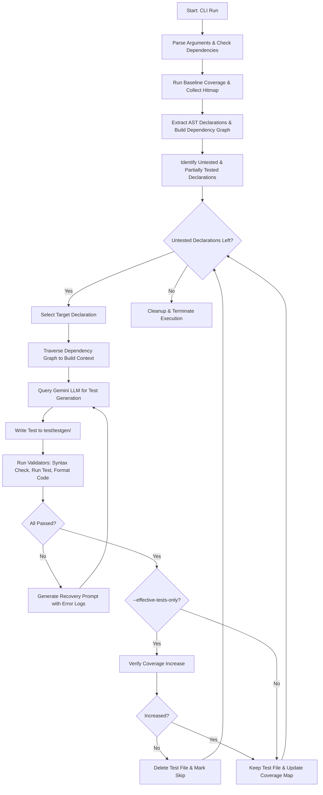

## 📐 Architecture & Execution Flow

Below is the step-by-step pipeline executed by [bin/flutter_test_gen_ai.dart](file:///home/arindam/Documents/flutter_test_gen_ai/bin/flutter_test_gen_ai.dart) when you run the tool:

### 1. Argument Parsing & Dependency Setup
Configures command flags and validates package paths. If the `test` library is missing from `pubspec.yaml`, the runner executes `dart pub add test --dev` automatically.

### 2. Dynamic Baseline Coverage Collection
Generates a temporary import file to ensure the coverage engine inspects all library files even if they have no existing tests. Spawns the Dart VM service with isolate pausing to collect precise execution hitmaps via [lib/src/coverage/coverage_collection.dart](file:///home/arindam/Documents/flutter_test_gen_ai/lib/src/coverage/coverage_collection.dart).

### 3. AST Parsing & Declaration Mapping
Traverses the AST using the Dart `analyzer` package in [lib/src/analyzer/extractor.dart](file:///home/arindam/Documents/flutter_test_gen_ai/lib/src/analyzer/extractor.dart). Maps all class constructors, functions, methods, and variables with their start/end line numbers.

### 4. Dependency Context Resolution
Traces references from the target declaration outward (up to `--max-depth`). This extracts structural details of any custom types or helper functions consumed by the target code, giving the LLM a clear map for creating mocks and setup fixtures.

### 5. Iterative Generation & Multi-Stage Validation
Sends prompts to the LLM via [lib/src/LLM/test_generator.dart](file:///home/arindam/Documents/flutter_test_gen_ai/lib/src/LLM/test_generator.dart). The generated file is validated using [lib/src/LLM/validator.dart](file:///home/arindam/Documents/flutter_test_gen_ai/lib/src/LLM/validator.dart):
* **Analysis**: Syntax parser validation.
* **Execution**: Runs the test to confirm it passes.
* **Formatting**: Verifies stylistic rules match `dart format`.
If a check fails, the CLI feeds the analyzer error/stack trace back to the LLM to self-heal (up to `--max-attempts` times).

1. If you are running it inside another project that depends on this package:
### dart run flutter_test_gen_ai --api-key [GCP_API_KEY]

2. If you are developing inside the package folder itself (running it locally):
### dart run bin/flutter_test_gen_ai.dart --api-key [GCP_API_KEY]
