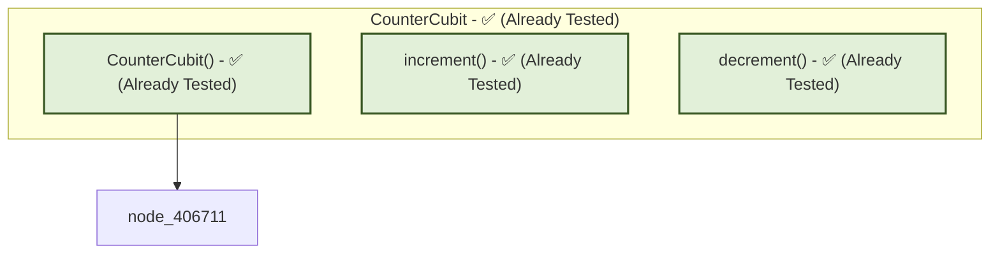

# TestGen Coverage & Dependency Report
Generated on: 2026-07-10 08:27:37 UTC

## Summary of Test Generation
- **Total Declarations:** 4
- **Already Fully Tested:** 4 ✅
- **Newly Tested (This Run):** 0 🎉
- **Remaining Untested/Partial:** 0 ⚠️

---
## Declaration Relationship & Coverage Map

### Legend
- **Green Box (Solid border)**: Already fully covered/tested.
- **Blue Box (Dashed border)**: Newly generated tests successfully covered this declaration in this run.
- **Orange Box (Solid border)**: Needs coverage. The line count indicates remaining uncovered lines.
