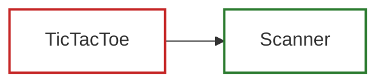

# TestGen Coverage & Dependency Report
Generated on: 2026-07-12 05:56:50 UTC

## Summary of Test Generation
- **Total Declarations:** 17
- **Already Fully Tested:** 16 ✅
- **Newly Tested (This Run):** 0 🎉
- **Remaining Untested/Partial:** 1 ⚠️

---
## Declaration Relationship & Coverage Map

### Legend
- **Green Border (Solid)**: Already fully covered/tested.
- **Blue Border (Dashed)**: Newly generated tests successfully covered this declaration in this run.
- **Red Border (Solid)**: Needs coverage.

---
## Coverage Breakdown by Class/File

### ⚠️ Needs Coverage: `TicTacToe`
- ✅ `grid`
- ✅ `PLAYER_X`
- ✅ `PLAYER_O`
- ✅ `currentPlayer`
- ✅ `TicTacToe`
- ✅ `run`
- ✅ `printGrid`
- ✅ `isGameOver`
- ✅ `hasWinner`
- ✅ `isRowWin`
- ✅ `isColWin`
- ❌ `isDiag1Win` (Lines: [3])
- ✅ `isDiag2Win`
- ✅ `isFull`

### ✅ Fully Covered: `Scanner`
- ✅ `_tokens`
- ✅ `_tokenIndex`
- ✅ `nextInt`
