# TestGen Coverage & Dependency Report
Generated on: 2026-07-11 08:36:23 UTC

## Summary of Test Generation
- **Total Declarations:** 19
- **Already Fully Tested:** 10 ✅
- **Newly Tested (This Run):** 9 🎉
- **Remaining Untested/Partial:** 0 ⚠️

---
## Declaration Relationship & Coverage Map

```mermaid
graph TD
  %% Styling
  classDef alreadyTested fill:#e2f0d9,stroke:#385723,stroke-width:2px;
  classDef newlyTested fill:#d9e1f2,stroke:#305496,stroke-width:2px,stroke-dasharray: 5 5;
  classDef untested fill:#fce4d6,stroke:#c65911,stroke-width:2px;

  subgraph Parent_58061 ["TicTacToe - ✅ (Already Tested)"]
    node_58063["grid() - ✅ (Already Tested)"]:::alreadyTested
    node_58066["PLAYER_X() - ✅ (Already Tested)"]:::alreadyTested
    node_58069["PLAYER_O() - ✅ (Already Tested)"]:::alreadyTested
    node_58072["currentPlayer() - ✅ (Already Tested)"]:::alreadyTested
    node_58079["TicTacToe() - ✅ (Already Tested)"]:::alreadyTested
    node_58080["run() - 🎉 ✅ (Newly Tested)"]:::newlyTested
    node_58081["printGrid() - 🎉 ✅ (Newly Tested)"]:::newlyTested
    node_58082["isGameOver() - 🎉 ✅ (Newly Tested)"]:::newlyTested
    node_58083["hasWinner() - 🎉 ✅ (Newly Tested)"]:::newlyTested
    node_58084["isRowWin() - 🎉 ✅ (Newly Tested)"]:::newlyTested
    node_58085["isColWin() - 🎉 ✅ (Newly Tested)"]:::newlyTested
    node_58086["isDiag1Win() - 🎉 ✅ (Newly Tested)"]:::newlyTested
    node_58087["isDiag2Win() - ✅ (Already Tested)"]:::alreadyTested
    node_58088["isFull() - 🎉 ✅ (Newly Tested)"]:::newlyTested
  end

  subgraph Parent_58062 ["Scanner - ✅ (Already Tested)"]
    node_58089["_tokens() - ✅ (Already Tested)"]:::alreadyTested
    node_58092["_tokenIndex() - ✅ (Already Tested)"]:::alreadyTested
    node_58099["nextInt() - 🎉 ✅ (Newly Tested)"]:::newlyTested
  end

  %% Dependency Lines
  node_58072 --> node_58066
  node_58079 --> node_58061
  node_58079 --> node_58063
  node_58080 --> node_58066
  node_58080 --> node_58063
  node_58080 --> node_58062
  node_58080 --> node_58081
  node_58080 --> node_58072
  node_58080 --> node_58099
  node_58080 --> node_58082
  node_58080 --> node_58083
  node_58080 --> node_58069
  node_58081 --> node_58063
  node_58082 --> node_58083
  node_58082 --> node_58088
  node_58083 --> node_58084
  node_58083 --> node_58085
  node_58083 --> node_58086
  node_58083 --> node_58087
  node_58084 --> node_58063
  node_58085 --> node_58063
  node_58086 --> node_58063
  node_58087 --> node_58063
  node_58088 --> node_58063
  node_58099 --> node_58092
  node_58099 --> node_58089
```

### Legend
- **Green Box (Solid border)**: Already fully covered/tested.
- **Blue Box (Dashed border)**: Newly generated tests successfully covered this declaration in this run.
- **Orange Box (Solid border)**: Needs coverage. The line count indicates remaining uncovered lines.
