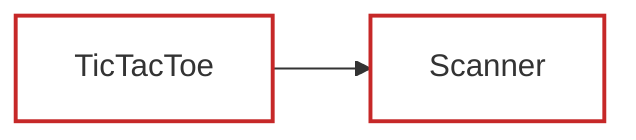

# TestGen Coverage & Dependency Report
Generated on: 2026-07-12 11:31:57 UTC

## Summary of Test Generation
- **Total Declarations:** 17
- **Already Fully Tested:** 5 ✅
- **Newly Tested (This Run):** 0 🎉
- **Remaining Untested/Partial:** 12 ⚠️

---
## Declaration Relationship & Coverage Map

### Legend
- **Green Border (Solid)**: Already fully covered/tested.
- **Blue Border (Dashed)**: Newly generated tests successfully covered this declaration in this run.
- **Red Border (Solid)**: Needs coverage.

---
## Coverage Breakdown by Class/File

### ⚠️ Needs Coverage: `TicTacToe`
- ❌ `grid` (Lines: [0])
- ✅ `PLAYER_X`
- ✅ `PLAYER_O`
- ✅ `currentPlayer`
- ❌ `TicTacToe` (Lines: [0, 2, 3, 4])
- ❌ `run` (Lines: [0, 1, 5, 8, 9, 10, 13, 16, 18, 21, 22, 24, 32])
- ❌ `printGrid` (Lines: [0, 1, 2, 3, 4, 5, 8, 9, 10])
- ❌ `isGameOver` (Lines: [0, 1])
- ❌ `hasWinner` (Lines: [0, 2, 3, 9, 10, 16])
- ❌ `isRowWin` (Lines: [0, 1, 2, 3])
- ❌ `isColWin` (Lines: [0, 1, 2, 3])
- ❌ `isDiag1Win` (Lines: [0, 1, 2, 3])
- ❌ `isDiag2Win` (Lines: [0, 1, 2, 3])
- ❌ `isFull` (Lines: [0, 1, 2, 3])

### ⚠️ Needs Coverage: `Scanner`
- ✅ `_tokens`
- ✅ `_tokenIndex`
- ❌ `nextInt` (Lines: [0, 1, 2, 4, 6, 7, 8, 10, 12])
