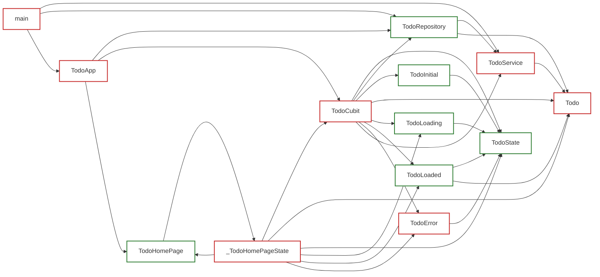

# TestGen Coverage & Dependency Report
Generated on: 2026-07-12 11:29:21 UTC

## Summary of Test Generation
- **Total Declarations:** 39
- **Already Fully Tested:** 28 ✅
- **Newly Tested (This Run):** 0 🎉
- **Remaining Untested/Partial:** 11 ⚠️

---
## Declaration Relationship & Coverage Map

### Legend
- **Green Border (Solid)**: Already fully covered/tested.
- **Blue Border (Dashed)**: Newly generated tests successfully covered this declaration in this run.
- **Red Border (Solid)**: Needs coverage.

---
## Coverage Breakdown by Class/File

### ✅ Fully Covered: `TodoRepository`
- ✅ `service`
- ✅ `TodoRepository`
- ✅ `getTodos`
- ✅ `createTodo`
- ✅ `removeTodo`

### ⚠️ Needs Coverage: `main`
- ❌ `main`

### ⚠️ Needs Coverage: `TodoApp`
- ✅ `TodoApp`
- ❌ `build` (Lines: [0, 2, 4, 6, 12, 13, 14])

### ✅ Fully Covered: `TodoHomePage`
- ✅ `TodoHomePage`
- ✅ `title`
- ✅ `createState`

### ⚠️ Needs Coverage: `_TodoHomePageState`
- ✅ `_textController`
- ✅ `_submitTodo`
- ❌ `build` (Lines: [24, 68, 69, 92, 93, 101, 102])
- ✅ `dispose`

### ✅ Fully Covered: `TodoState`
- ✅ `TodoState`

### ✅ Fully Covered: `TodoInitial`
- ✅ `TodoInitial`

### ✅ Fully Covered: `TodoLoading`
- ✅ `TodoLoading`

### ✅ Fully Covered: `TodoLoaded`
- ✅ `todos`
- ✅ `TodoLoaded`

### ⚠️ Needs Coverage: `TodoError`
- ✅ `message`
- ❌ `TodoError` (Lines: [0])

### ⚠️ Needs Coverage: `TodoCubit`
- ✅ `repository`
- ❌ `TodoCubit` (Lines: [0])
- ❌ `loadTodos` (Lines: [0, 1, 3, 4, 6])
- ❌ `addTodo` (Lines: [0, 1, 3, 4, 6])
- ❌ `toggleTodoStatus` (Lines: [0, 2, 3, 4, 6])
- ❌ `deleteTodo` (Lines: [0, 2, 3, 5])

### ⚠️ Needs Coverage: `TodoService`
- ✅ `_localDatabase`
- ❌ `fetchTodos` (Lines: [0, 1, 2, 3, 4])
- ✅ `saveTodo`
- ✅ `deleteTodo`

### ⚠️ Needs Coverage: `Todo`
- ✅ `id`
- ✅ `title`
- ✅ `isCompleted`
- ✅ `Todo`
- ❌ `copyWith` (Lines: [0, 1, 2, 3, 4])
- ✅ `toJson`
- ✅ `Todo.fromJson`
