# TestGen Coverage & Dependency Report
Generated on: 2026-07-11 10:13:49 UTC

## Summary of Test Generation
- **Total Declarations:** 13
- **Already Fully Tested:** 7 ✅
- **Newly Tested (This Run):** 0 🎉
- **Remaining Untested/Partial:** 6 ⚠️

---
## Declaration Relationship & Coverage Map

```mermaid
graph TD
  %% Styling
  classDef alreadyTested fill:#e2f0d9,stroke:#385723,stroke-width:2px;
  classDef newlyTested fill:#d9e1f2,stroke:#305496,stroke-width:2px,stroke-dasharray: 5 5;
  classDef untested fill:#fce4d6,stroke:#c65911,stroke-width:2px;

  subgraph Parent_406818 ["main - ⚠️ (Needs Coverage: 7 lines)"]
    node_406818["main"]:::untested
  end

  subgraph Parent_406819 ["TodoApp - ✅ (Already Tested)"]
    node_406822["TodoApp() - ✅ (Already Tested)"]:::alreadyTested
    node_406823["build() - ⚠️ (Needs Coverage: 8 lines)"]:::untested
  end

  subgraph Parent_406820 ["TodoHomePage - ✅ (Already Tested)"]
    node_406824["TodoHomePage() - ✅ (Already Tested)"]:::alreadyTested
    node_406825["title() - ✅ (Already Tested)"]:::alreadyTested
    node_406828["createState() - ⚠️ (Needs Coverage: 2 lines)"]:::untested
  end

  subgraph Parent_406821 ["_TodoHomePageState - ✅ (Already Tested)"]
    node_406829["_textController() - ✅ (Already Tested)"]:::alreadyTested
    node_406832["_submitTodo() - ⚠️ (Needs Coverage: 5 lines)"]:::untested
    node_406833["build() - ⚠️ (Needs Coverage: 50 lines)"]:::untested
    node_406834["dispose() - ⚠️ (Needs Coverage: 3 lines)"]:::untested
  end

  %% Dependency Lines
  node_406818 --> node_38350
  node_406818 --> node_38374
  node_406818 --> node_406819
  node_406822 --> node_406819
  node_406823 --> node_38374
  node_406823 --> node_406764
  node_406823 --> node_406777
  node_406823 --> node_406820
  node_406824 --> node_406820
  node_406828 --> node_406820
  node_406828 --> node_406821
  node_406821 --> node_406820
  node_406832 --> node_406764
  node_406832 --> node_406829
  node_406832 --> node_406778
  node_406833 --> node_38318
  node_406833 --> node_406764
  node_406833 --> node_406829
  node_406833 --> node_406825
  node_406833 --> node_406832
  node_406833 --> node_406759
  node_406833 --> node_406761
  node_406833 --> node_406762
  node_406833 --> node_406765
  node_406833 --> node_38319
  node_406833 --> node_38325
  node_406833 --> node_406779
  node_406833 --> node_38322
  node_406833 --> node_406780
  node_406833 --> node_406763
  node_406833 --> node_406769
  node_406834 --> node_406829
```

### Legend
- **Green Box (Solid border)**: Already fully covered/tested.
- **Blue Box (Dashed border)**: Newly generated tests successfully covered this declaration in this run.
- **Orange Box (Solid border)**: Needs coverage. The line count indicates remaining uncovered lines.
